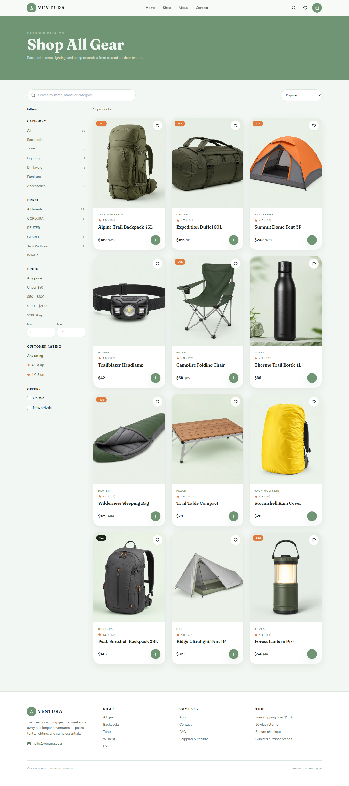

# Ventura — Camping & Outdoor Gear

A premium camping e-commerce storefront inspired by modern outdoor retail UI.

**Live:** [https://ventura-gfdg3.vercel.app](https://ventura-gfdg3.vercel.app)

Built with **Next.js 14**, **React**, **TypeScript**, **Tailwind CSS**, **Prisma**, and **Framer Motion**.

## Features

- Landing page with hero, categories, deals countdown, brand showcase
- Product catalog with search and filters
- Product detail with colorway previews, cart, and checkout
- Guest cart, wishlist, and orders stored in the database
- Contact form with message persistence

## Screenshots

### Home


### Shop



### Product detail


### Cart


### Checkout


### Wishlist


### About


### Contact


### FAQ


### Shipping & Returns


## Getting Started

```bash
npm install
npm run prisma:generate
npm run prisma:seed
npm run dev
```

Open [http://localhost:3000](http://localhost:3000)

## Scripts

| Command         | Description      |
|-----------------|------------------|
| `npm run dev`   | Start dev server |
| `npm run build` | Production build |
| `npm start`     | Start production |
| `npm run lint`  | Run ESLint       |
| `npm run prisma:seed` | Seed the local database |
